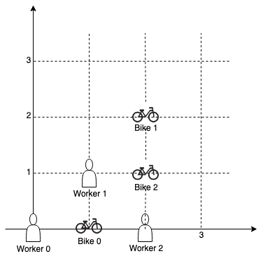

### 1057\. [Campus Bikes](https://leetcode.com/problems/campus-bikes/)

On a campus represented as a 2D grid, there are N workers and M bikes, with N <= M. Each worker and bike is a 2D coordinate on this grid.

Our goal is to assign a bike to each worker. Among the available bikes and workers, we choose the (worker, bike) pair with the shortest Manhattan distance between each other, and assign the bike to that worker. (If there are multiple (worker, bike) pairs with the same shortest Manhattan distance, we choose the pair with the smallest worker index; if there are multiple ways to do that, we choose the pair with the smallest bike index). We repeat this process until there are no available workers.

The Manhattan distance between two points p1 and p2 is Manhattan(p1, p2) = |p1.x - p2.x| + |p1.y - p2.y|.

Return a vector ans of length N, where ans[i] is the index (0-indexed) of the bike that the i-th worker is assigned to.


Example 1:


```
Input: workers = [[0,0],[2,1]], bikes = [[1,2],[3,3]]
Output: [1,0]
Explanation: 
Worker 1 grabs Bike 0 as they are closest (without ties), and Worker 0 is assigned Bike 1. So the output is [1, 0].
```

Example 2:



```
Input: workers = [[0,0],[1,1],[2,0]], bikes = [[1,0],[2,2],[2,1]]
Output: [0,2,1]
Explanation: 
Worker 0 grabs Bike 0 at first. Worker 1 and Worker 2 share the same distance to Bike 2, thus Worker 1 is assigned to Bike 2, and Worker 2 will take Bike 1. So the output is [0,2,1].
```

Note:

1. ```0 <= workers[i][j], bikes[i][j] < 1000```
2. All worker and bike locations are distinct.
3. ```1 <= workers.length <= bikes.length <= 1000```


#### Solution 1

Bucket sort

C++

```
class Solution {
public:
    // bucket sort
    // O(N*M) time, O(N*M) space
    vector<int> assignBikes(vector<vector<int>>& workers, vector<vector<int>>& bikes) {
        // bucket sort since range of distance is [0, 2000]
        vector<vector<pair<int, int>>> buckets(2001); // buckets[i] is the vector<worker id, bike id> with distance i
        int n = workers.size(), m = bikes.size();
        // pairwise distance
        for (int i = 0; i < n; i++) {
            for (int j = 0; j < m; j++) {
                int d = dist(workers[i], bikes[j]);
                buckets[d].push_back({i, j});
            }
        }
        vector<int> res(n, -1);
        vector<bool> bikeUsed(m, false);
        for (int d = 0; d <= 2000; d++) {
            for (int k = 0; k < buckets[d].size(); k++) {
                // if both worker and bike are not assigned
                // because of the way the pairwise distance is calculated, 
                // smaller worker index comes first if same distance
                if (res[buckets[d][k].first] == -1 && !bikeUsed[buckets[d][k].second]) {
                    bikeUsed[buckets[d][k].second] = true;
                    res[buckets[d][k].first] = buckets[d][k].second;
                }
            }
        }
        return res;
    }

    int dist(vector<int>& p1, vector<int>& p2) {
    	return abs(p1[0] - p2[0]) + abs(p1[1] - p2[1]);
    }
};
```
