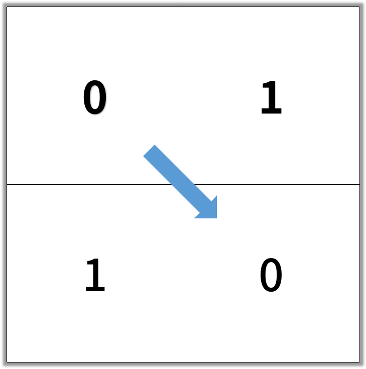

### 1091\. [Shortest Path in Binary Matrix](https://leetcode.com/problems/shortest-path-in-binary-matrix/)

In an N by N square grid, each cell is either empty (0) or blocked (1).

A clear path from top-left to bottom-right has length k if and only if it is composed of cells C_1, C_2, ..., C_k such that:

Adjacent cells C_i and C_{i+1} are connected 8-directionally (ie., they are different and share an edge or corner)
C_1 is at location (0, 0) (ie. has value ```grid[0][0]```)
C_k is at location (N-1, N-1) (ie. has value ```grid[N-1][N-1]```)
If C_i is located at (r, c), then ```grid[r][c]``` is empty (ie. ```grid[r][c] == 0```).
Return the length of the shortest such clear path from top-left to bottom-right.  If such a path does not exist, return -1.

 

Example 1:



```
Input: [[0,1],[1,0]]
Output: 2
```
Example 2:


```
Input: [[0,0,0],[1,1,0],[1,1,0]]
Output: 4
```
 

Note:

1. 1 <= grid.length == grid[0].length <= 100
2. grid[r][c] is 0 or 1

#### Solution 1

BFS

Time: O(mn)
Space: O(mn)

C++

```
class Solution {
public:
    int shortestPathBinaryMatrix(vector<vector<int>>& grid) {
        if (grid.empty() or grid[0].empty()) return -1;
        int m = grid.size();
        int n = grid[0].size();
        vector<vector<bool>> visited(m, vector<bool>(n, false));
        queue<pair<int, int>> todo;
        if (grid[0][0] == 0) todo.push({0, 0});
        visited[0][0] = true;
        int len = 0;
        while (!todo.empty()) {
            ++len;
            for (int k = todo.size() - 1; k >= 0; --k) {
                auto t = todo.front(); todo.pop();
                int i = t.first;
                int j = t.second;
                if (i == m - 1 and j == n - 1) return len;
                for (int x = i - 1; x <= i + 1; ++x) {
                    for (int y = j - 1; y <= j + 1; ++y) {
                        if (x < 0 or y < 0 or x >= m or y >= n or visited[x][y] or (x == i and y == j) or grid[x][y]) continue;
                        todo.push({x, y});
						visited[x][y] = true;
                    }
                }
            }
        }
        return -1;
    }
};
```
Save space but modify original array. 
Can add  ``` if (grid[i][j] == -1) grid[i][j] = 0; ```
to change it back.

Time: O(mn)
Space: O(1)

```
class Solution {
public:
    int shortestPathBinaryMatrix(vector<vector<int>>& grid) {
        if (grid.empty() or grid[0].empty()) return -1;
        int m = grid.size();
        int n = grid[0].size();
        queue<pair<int, int>> todo;
        if (grid[0][0] == 0) todo.push({0, 0});
        grid[0][0] = -1;
        int len = 0;
        while (!todo.empty()) {
            ++len;
            for (int k = todo.size() - 1; k >= 0; --k) {
                auto t = todo.front(); todo.pop();
                int i = t.first;
                int j = t.second;
                if (i == m - 1 and j == n - 1) return len;
                for (int x = i - 1; x <= i + 1; ++x) {
                    for (int y = j - 1; y <= j + 1; ++y) {
                        if (x < 0 or y < 0 or x >= m or y >= n or (x == i and y == j) or grid[x][y] != 0) continue;
                        todo.push({x, y});
						grid[x][y] = -1;
                    }
                }
            }
        }
        return -1;
    }
};
```
