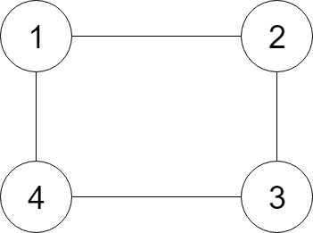

### 133\. [Clone Graph](https://leetcode.com/problems/clone-graph/)

Given a reference of a node in a connected undirected graph, return a deep copy (clone) of the graph. Each node in the graph contains a val (int) and a list (List[Node]) of its neighbors.

Example:


```
Input:
{"$id":"1","neighbors":[{"$id":"2","neighbors":[{"$ref":"1"},{"$id":"3","neighbors":[{"$ref":"2"},{"$id":"4","neighbors":[{"$ref":"3"},{"$ref":"1"}],"val":4}],"val":3}],"val":2},{"$ref":"4"}],"val":1}

Explanation:
Node 1's value is 1, and it has two neighbors: Node 2 and 4.
Node 2's value is 2, and it has two neighbors: Node 1 and 3.
Node 3's value is 3, and it has two neighbors: Node 2 and 4.
Node 4's value is 4, and it has two neighbors: Node 1 and 3.
```

Note:

1. The number of nodes will be between 1 and 100.
2. The undirected graph is a simple graph, which means no repeated edges and no self-loops in the graph.
3. Since the graph is undirected, if node p has node q as neighbor, then node q must have node p as neighbor too.
4. You must return the copy of the given node as a reference to the cloned graph.

#### Solution 1

DFS

C++

```
/*
// Definition for a Node.
class Node {
public:
    int val;
    vector<Node*> neighbors;

    Node() {}

    Node(int _val, vector<Node*> _neighbors) {
        val = _val;
        neighbors = _neighbors;
    }
};
*/
class Solution {
public:
    Node* cloneGraph(Node* node) {
        unordered_map<Node*, Node*> m;
        return dfs(node, m);
    }
    
    Node* dfs(Node* node, unordered_map<Node*, Node*>& m) {
        if (!node) return NULL;
        m[node] = new Node(node->val);
        for (Node* n : node->neighbors) {
            Node* t = !m.count(n) ? dfs(n, m) : m[n];
            m[node]->neighbors.push_back(t);
        }
        return m[node];
    }
};
```

#### Solution 2

BFS

C++

```
/*
// Definition for a Node.
class Node {
public:
    int val;
    vector<Node*> neighbors;

    Node() {}

    Node(int _val, vector<Node*> _neighbors) {
        val = _val;
        neighbors = _neighbors;
    }
};
*/
class Solution {
public:
    Node* cloneGraph(Node* node) {
        if (!node) return NULL;
        unordered_map<Node*, Node*> m;
        queue<Node*> todo;
        todo.push(node);
        m[node] = new Node(node->val);
        while (!todo.empty()) {
            Node* t = todo.front(); todo.pop();
            for (Node* n : t->neighbors) {
                if (!m.count(n)) {
                    m[n] = new Node(n->val);
                    todo.push(n);
                }
                m[t]->neighbors.push_back(m[n]);
            }
        }
        return m[node];
    }
};
```
