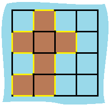

### 463\. [Island Perimeter](https://leetcode.com/problems/island-perimeter/)

You are given a map in form of a two-dimensional integer grid where 1 represents land and 0 represents water.

Grid cells are connected horizontally/vertically (not diagonally). The grid is completely surrounded by water, and there is exactly one island (i.e., one or more connected land cells).

The island doesn't have "lakes" (water inside that isn't connected to the water around the island). One cell is a square with side length 1. The grid is rectangular, width and height don't exceed 100. Determine the perimeter of the island.

Example:


    
```
Input:
[[0,1,0,0],
 [1,1,1,0],
 [0,1,0,0],
 [1,1,0,0]]

Output: 16

Explanation: The perimeter is the 16 yellow stripes in the image below:
```

#### Solution 1

For each occupied cell, if it is the most left cell or its left is empty,
perimeter++. Same with right, top, and bottom.

C++

```
class Solution {
public:
    int islandPerimeter(vector<vector<int>>& grid) {
        int m = grid.size(), n = grid[0].size(), res = 0;
        for (int i = 0; i < m; i++) {
            for (int j = 0; j < n; j++) {
                if (grid[i][j]== 0) continue;
                if (j == 0 || grid[i][j-1] == 0) res++; // left edge
                if (j == n-1 || grid[i][j+1] == 0) res++; // right edge
                if (i == 0 || grid[i-1][j] == 0) res++; // top edge
                if (i == m-1 || grid[i+1][j] == 0) res++; // bottom edge
            }
        }
        return res;
    }
};
```

For each occupied cell, perimeter += 4. If the cell has a left or top 
neighbor, perimeter -= 2.

C++

```
class Solution {
public:
    int islandPerimeter(vector<vector<int>>& grid) {
        int m = grid.size(), n = grid[0].size(), res = 0;
        for (int i = 0; i < m; i++) {
            for (int j = 0; j < n; j++) {
                if (grid[i][j] == 0) continue;
                res += 4;
                if (i > 0 && grid[i-1][j] == 1) res -= 2;
                if (j > 0 && grid[i][j-1] == 1) res -= 2;
            }
        }
        return res;
    }
};
```
