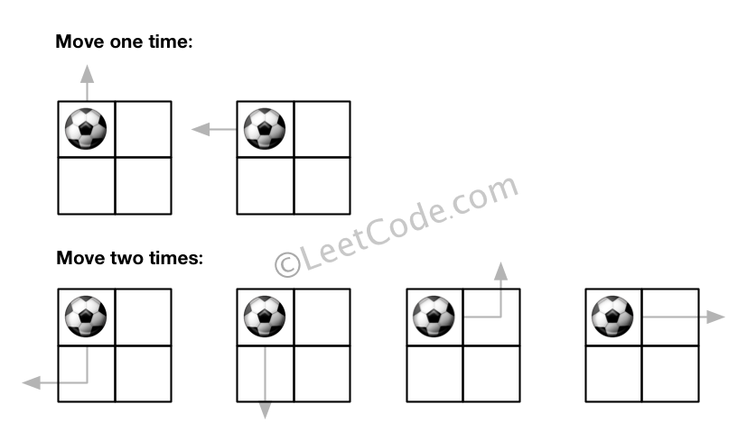
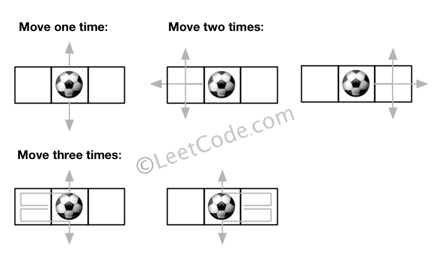

### 576\. [Out of Boundary Paths](https://leetcode.com/problems/out-of-boundary-paths/)

There is an m by n grid with a ball. Given the start coordinate (i,j) of the ball, you can move the ball to adjacent cell or cross the grid boundary in four directions (up, down, left, right). However, you can at most move N times. Find out the number of paths to move the ball out of grid boundary. The answer may be very large, return it after mod 109 + 7.

Example 1:



```
Input: m = 2, n = 2, N = 2, i = 0, j = 0
Output: 6
Explanation:
```
Example 2:



```
Input: m = 1, n = 3, N = 3, i = 0, j = 1
Output: 12
Explanation:
```

Note:

1. Once you move the ball out of boundary, you cannot move it back.
2. The length and height of the grid is in range [1,50].
3. N is in range [0,50].


#### Solution 1

DP

C++

```
class Solution {
public:
    int findPaths(int m, int n, int N, int i, int j) {
      uint dp[51][50][50] = {};
      for (auto Ni = 1; Ni <= N; ++Ni)
        for (auto mi = 0; mi < m; ++mi)
          for (auto ni = 0; ni < n; ++ni)
            dp[Ni][mi][ni] = ((mi == 0     ? 1 : dp[Ni - 1][mi - 1][ni]) 
                            + (mi == m - 1 ? 1 : dp[Ni - 1][mi + 1][ni])
                            + (ni == 0     ? 1 : dp[Ni - 1][mi][ni - 1]) 
                            + (ni == n - 1 ? 1 : dp[Ni - 1][mi][ni + 1])
                             ) % 1000000007;
      return dp[N][i][j];
    }
};
```

Less memory use. Update is only based on the previous state.

```
class Solution {
public:
    int findPaths(int m, int n, int N, int i, int j) {
      uint dp[2][50][50] = {};
      while (N-- > 0)
        for (size_t mi = 0; mi < m; ++mi)
          for (size_t ni = 0; ni < n; ++ni) {
              size_t nc = (N + 1) % 2, np = N % 2;
              dp[nc][mi][ni] = ((mi == 0     ? 1 : dp[np][mi - 1][ni]) 
                + (mi == m - 1 ? 1 : dp[np][mi + 1][ni])
                + (ni == 0     ? 1 : dp[np][mi][ni - 1]) 
                + (ni == n - 1 ? 1 : dp[np][mi][ni + 1])
                 ) % 1000000007;
          }

      return dp[1][i][j];
    }
};
```
