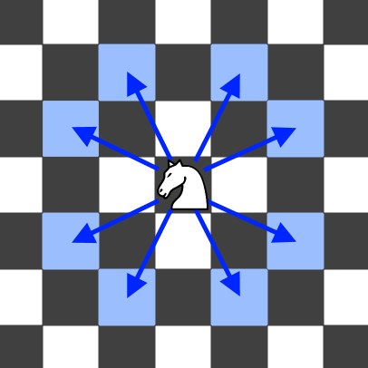

### 688\. [Knight Probability in Chessboard](https://leetcode.com/problems/knight-probability-in-chessboard/)

On an NxN chessboard, a knight starts at the r-th row and c-th column and attempts to make exactly K moves. The rows and columns are 0 indexed, so the top-left square is (0, 0), and the bottom-right square is (N-1, N-1).

A chess knight has 8 possible moves it can make, as illustrated below. Each move is two squares in a cardinal direction, then one square in an orthogonal direction.
 


Each time the knight is to move, it chooses one of eight possible moves uniformly at random (even if the piece would go off the chessboard) and moves there.

The knight continues moving until it has made exactly K moves or has moved off the chessboard. Return the probability that the knight remains on the board after it has stopped moving.

Example:
```
Input: 3, 2, 0, 0
Output: 0.0625
Explanation: There are two moves (to (1,2), (2,1)) that will keep the knight on the board.
From each of those positions, there are also two moves that will keep the knight on the board.
The total probability the knight stays on the board is 0.0625.
```

Note:

1. N will be between 1 and 25.
2. K will be between 0 and 100.
3. The knight always initially starts on the board.

#### Solution 1

C++

```
class Solution {
public:
    double knightProbability(int N, int K, int r, int c) {
        vector<vector<vector<double>>> dp(K+1, vector<vector<double>>(N, vector<double>(N, -1.0)));
        return helper(dp, N, K, r, c)/pow(8, K);
    }
private:
    double helper(vector<vector<vector<double>>>& dp, int N, int k, int r, int c) {
        // if out of board, return 0.0
        if (r < 0 || r >= N || c < 0 || c >= N) return 0.0;
        // when k = 0, no more move, so it's 100% safe
        if (k == 0) return 1.0;
        if (dp[k][r][c] != -1.0) return dp[k][r][c];
        dp[k][r][c] = 0.0;
        for (int i = -2; i <= 2; i++) {
            if (i == 0) continue;
            dp[k][r][c] += helper(dp, N, k-1, r+i, c+3-abs(i)) + helper(dp, N, k-1, r+i, c-(3-abs(i)));
        }
        // {
        //     dp[K][r][c] += helper(dp, N, K - 1, r - 2, c - 1);
        //     dp[K][r][c] += helper(dp, N, K - 1, r - 2, c + 1);
        //     dp[K][r][c] += helper(dp, N, K - 1, r - 1, c - 2);
        //     dp[K][r][c] += helper(dp, N, K - 1, r - 1, c + 2);
        //     dp[K][r][c] += helper(dp, N, K - 1, r + 1, c - 2);
        //     dp[K][r][c] += helper(dp, N, K - 1, r + 1, c + 2);
        //     dp[K][r][c] += helper(dp, N, K - 1, r + 2, c - 1);
        //     dp[K][r][c] += helper(dp, N, K - 1, r + 2, c + 1);
        // }
        return dp[k][r][c];
    }
};
```


#### Solution 2

C++

```
class Solution {
public:
    double knightProbability(int N, int K, int r, int c) {
        if (K == 0) return 1;
        vector<vector<double>> dp(N, vector<double>(N, 1));
        vector<vector<int>> dirs{{-1,-2},{-2,-1},{-2,1},{-1,2},{1,2},{2,1},{2,-1},{1,-2}};
        for (int m = 0; m < K; ++m) {
            vector<vector<double>> t(N, vector<double>(N, 0));
            for (int i = 0; i < N; ++i) {
                for (int j = 0; j < N; ++j) {
                    for (int k = 0; k < 8; k++) {
                        int x = i + dirs[k][0], y = j + dirs[k][1];
                        if (x < 0 || x >= N || y < 0 || y >= N) continue;
                        t[i][j] += dp[x][y];
                    }
                }
            }
            dp = t;
        }
        return dp[r][c] / pow(8, K);
    }
};
```
