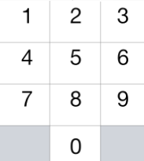

### 935\. [Knight Dialer](https://leetcode.com/problems/knight-dialer/)

A chess knight can move as indicated in the chess diagram below:



This time, we place our chess knight on any numbered key of a phone pad (indicated above), and the knight makes N-1 hops.  Each hop must be from one key to another numbered key.

Each time it lands on a key (including the initial placement of the knight), it presses the number of that key, pressing N digits total.

How many distinct numbers can you dial in this manner?

Since the answer may be large, output the answer modulo 10^9 + 7.

Example 1:
```
Input: 1
Output: 10
```

Example 2:
```
Input: 2
Output: 20
```
Example 3:
```
Input: 3
Output: 46
```

Note:
* 1 <= N <= 5000

#### Solution 1

Use the same algorithm as in [688. Knight Probability in Chessboard](688_knightProbability.md)

C++

```
class Solution {
public:
    int knightDialer(int N) {
        vector<vector<long>> dp(4, vector<long>(3, 1));
        vector<pair<int, int>> dirs = {{1, 2}, {2, 1}, {2, -1}, {1, -2}, {-1, -2}, {-2, -1}, {-2, 1}, {-1, 2}};
        for (int n = 0; n < N - 1; n++) {
            vector<vector<long>> t(4, vector<long>(3, 0));
            for (int i = 0; i < 4; i++) {
                for (int j = 0; j < 3; j++) {
                    if (i == 3 and j == 0) continue;
                    if (i == 3 and j == 2) continue;
                    for (auto& d : dirs) {
                        int x = i + d.first;
                        int y = j + d.second;
                        if (x < 0 or y < 0 or x > 3 or y > 2) continue;
                        if (x == 3 and y == 0) continue;
                        if (x == 3 and y == 2) continue;
                        t[i][j] += dp[x][y] % 1000000007;
                    }
                }
            } 
            dp = t;
        }
        long res = 0;
        dp[3][0] = 0;
        dp[3][2] = 0;
        for (int i = 0; i < 4; i++) {
            for (int j = 0; j < 3; j++) {
                res += dp[i][j];
            }
        }
        return res % 1000000007;
    }
};
```

#### Solution 2

C++

```

```
